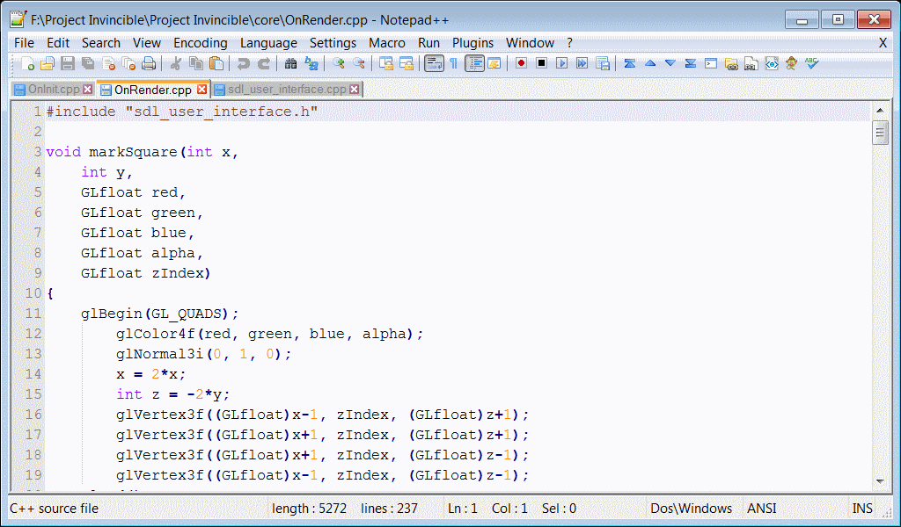
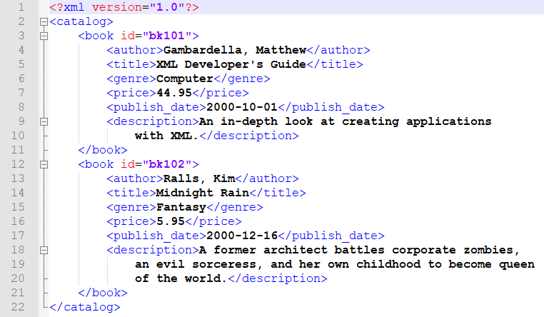

# Chapter I: XML file basics. 
Part 1. What XML is. 
Part 2. Recommend software to edit XML files. 
Part 2.1. How to use Notepad++. 
Part 3. Basics of XML structure.

# Part 1. What XML is.
XML (Extensible Markup Language) — is a markup language and file format for storing, sending, and reconstructing data.There are some benefits to collect data with this language. 
- has few rules to work with it;
- easy to extend data (add new objects); 
- easy to describe data (we can define any attributes for specify object); 
- support any nesting level (we can describe object => inside another object => inside another object ... and so on);
- human-readable language (you can understand what it contains if you can read object data with in English);  
Files of XML format have `.xml` extension.

# Part 2. Recommend software to edit XML.
If you have any programming language experience and still writing code, in this case I recommend to use any integrated development environment (IDE) - Webstorm by JetBrains or Visual Studio Code (VSC) for example. 

But if you haven't any code experience then I recommend to download [Notepad++](https://notepad-plus-plus.org/downloads/). Download latest version installer from this link. 
This editor is like basic Windows Notepad but has list of benefits. There are some of them:
- you can open any text file with this editor (just drag-and-drop);
- has tabs with all recent opened files;
- shows string number (at the left) and column number (at the bottom);
- has file syntax highlighting.

Starting this part I will describe explain something with Notepad++ application (screenshots included).

# Part 2.1. How to use Notepad++.
After installing Notepad++ on right-click on any file you will see "Open in Notepad++" option. If not, you can open file with Notepad++ with drag-and-drop to application tab or using "Open with" option.  
You can open many files inside one application window and moving between them (instead of many Windows Notepads). You can drag-and-drop any file from file tab (at the top) to the right side: you will see split window, each part will have its own files tab. Now you can expore and edit 2 files at same time.  
When you start to edit your file you will notice that "floppy disk" icon's color changed from blue to red. It indicates that you have unsaved changes. Click to `File => Save` to save current file.

  
  <b>Notepad++ tab example with C++ code. You can see setting tab at the top and file tab below first one.</b>

Some useful tips:
- right-click to file on tab to close:
  - all files;
  - all except current;
  - all the left/right;
- click to View at settings tab (at the top) and click on "Word wrap" option for showing long string in many strings according your window size (this option doesn't change file).

Some useful shortcuts:
- save file: `Ctrl+S`;
- search in current file: `Ctrl+F`; 
- search in all files of specify folder: `Ctrl+Shift+F`;
- replace: `Ctrl+H`;

# Part 3. Basics of XML structure.
Let's look at the example of XML file, note important parts of its structure. You can find XML example [here](https://github.com/ZhenjaMax/BBG-Translator-tools/tree/main/examples/1.xml).

  
  <b>XML example opened in Notepad++.</b>

*TIP: `tag` is part of XML file that includes word (tag name) between `<`,`>` characters. There are opening tag and closing tag (sometimes it isn't needed!), the difference between them is `/` character at start of closing tag.*

1. XML Header (or "XML Prolog") at string #1. 
Tag that may contain additional information like character encoding or file version.
2. Root element named `catalog`. 
Outer element that contains all other inner elements. It goes through file, from start to very end.
   - Opening tag at line #2.
   - Closing tag at line #22. 
3. Element named `book`.
   - Opening tag at line #3 with attribute `id`.
   - Closing tag at line #11.
4. Inner nested elements at strings #4 ... #10.

Now we can note important rules of XML file structure.
1. File starting with XML Header.
2. File must have main object with root tags; main object contains all other objects.
3. Objects may have attributes; they have syntax `attribute="value"` and listing inside opening object tag within space character.
4. Tag names cannot contain space characters.
5. All tags (except XML Header) must have opening and closing tag.  
6. Tag names are case sensitive.
7. All tags must be properly nested. It means that any pair of opening and closing tag must contain or not contain another pair of opening and closing tag. Syntax like this: `<aaa><bbb>Sample text</aaa></bbb>` is incorrect becuase opening tag `<bbb>` inside tags `<aaa>` and `</aaa>` but closing tag `</bbb>` is outside of them.
