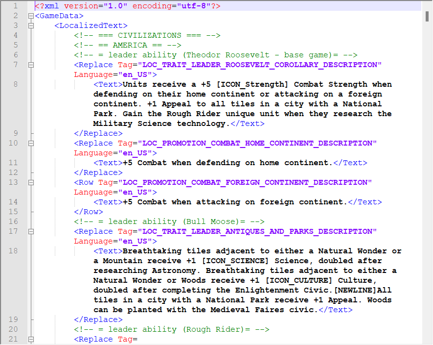
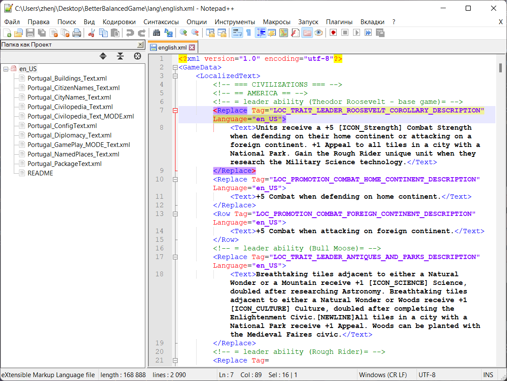
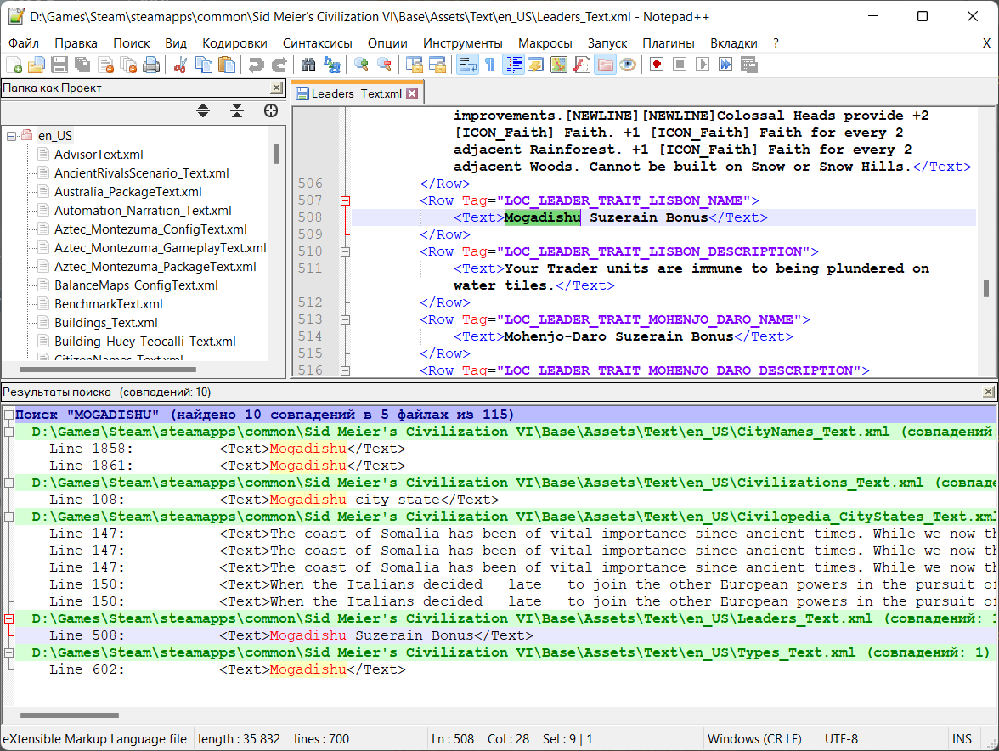
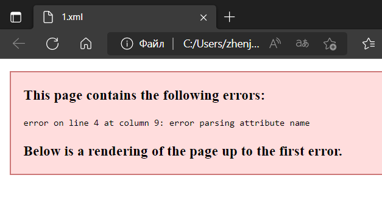

# Chapter II: Writing XML language file for BBG mod.
Part 1. Structure of BBG language file (in terms of XML). 
Part 2. Guidelines for BBG language file. 
Part 3. Searching for custom text tag. 
Part 4. How to check your language file. 
Part 5. When you need to check something rare...

# Part 1. Structure of BBG language file (in terms of XML).
Let's look at a part of this file (english.xml for example) and note important notes about it.

  

- XML Header at line #1;
- `GameData` root element (opening tag) at line #2 and inner element `LocalizedText` (opening tag) at line #3;
- comment lines #4 ... #6;
- `Replace` opening tag at line #7:
  - has attribute `Tag="LOC_TRAIT_LEADER_ROOSEVELT_COROLLARY_DESCRIPTION"`;
  - has attribute `Language="en_US"`.
- `Text` (opening tag and closing tags) at line #8 with string inside: it is new text that will be shown for English language instead;
- `Replace` closing tag at line #9;
- don't forget to note `Row` tag at lines #13, #15.

Explanations and recommendations.
1. For this example we can conclude that game will **replace** (`Replace` tag) for English language (`Language` attribute) text inside `Text` object for tag named `LOC_TRAIT_LEADER_ROOSEVELT_COROLLARY_DESCRIPTION`.
2. Comment lines are creating file structure for translators and other users (see pt. 2 below).
3. You should not change XML Header, `GameData` and `LocalizedText` tags placement.
4. There are only 2 possible tags for language file:
- `Replace` tag should be used for already existing game tags in base-game (it means all Firaxis content);
- `Row` tag should be used for for non-existing game tags (it means all new mechanics from BBG mod). 
It's very important to make difference between these tags. Your language file will be non-working if you place wrong tag. *If you unsure, you can check english.xml file or ask Translators or Chef-Translator in #translator-chat channel.*
5. Outer `Replace` or `Row` object contain `Text` object with text between its tags.
6. `Language` attribute is the same **for all objects** in current file.
7. To add new translation line, you need:
   1. copy object with `Replace` or `Row` tag (see above) from opening tag to closing tag;
   2. change `Tag` attribute and string inside `Text` tags;
   3. put this object to place it fits (see pt. 2 below).

# Part 2. Guidelines for BBG language file.
There are some rules you should follow when you edit file.
1. BBG language file has special structure (in terms of placing elements for):
   - if you add new tag then you need to write it in the right place (specified civilization ability, pantheon, city-state and so on; use search through file to find good place for it);
   - if you cannot find place for your tag then it probably doesn't exist. So you need create comment line at some category of tags (to keep structure of translation file) and put tag below it.
   - you **<ins>should not</ins>** just put your tag at the end of file!
2. Keep style of capital letters and small letters from Firaxis text through your text. Check first letters of terms "Science, Tech tree, City-State, Desert" etc. in your language.
3. Check your current gameplay text before you add XML tag and write text for it:
   - some tags are for English only because a lot of English lines are not clear for users and need to rework;
   - you probably already have this tag in your file: use search through file to be sure that you haven't duplicates in your file.
4. Keep spaces before tags (at the start of line) according to nesting level. Use "Tab key" on keyboard to write tabulation character.
5. Use game icons where they really needed. You can check original text, English text to find out where you should or should not keep icons. In usual, game icons are written in square brackets like upper-case words with `_` character between words (for example, `[ICON_FOOD]`).

# Part 3. Searching for custom text tag.
For this example, Let's assume that **Mogadishu trade City-ctate** description in your language is incorrect, and you need to fix that.
1. At first, you should try to find tag you need in `english.xml`
 file. Remember City-state description and search through file for keywords ("Mogadishu", "are immune", "plunder" and so on). If you found tag you need, just replace `Language` attribute and description inside `Text` tags (pt. 1, see above). If you cannot find it probably doesn't exist in `english.xml` so you need to find it in game.
2. We need to find all versions that changing this game object in any way. Go to (for example) [online-civilopedia](https://civilization.fandom.com/wiki/Mogadishu_(Civ6)) and check list of changes for this City-state.  
`Mogadishu is a trade city-state in Civilization VI. It replaced Lisbon under all rulesets in the Portugal Pack.`  
`Lisbon is a trade city-state in Civilization VI.`  
3. Go to Civilization VI DLC folder. Path is: `Steam\steamapps\common\Sid Meier's Civilization VI\DLC`. Find Portugal Pack and go to folder: `DLC\Portugal\Text\en_US`. Drag-and-drop `en_US` folder to Notepad++ window. You will open "Folder as Project" and see something like on screenshot below.

  

Now click right-button on project folder and search through all files with keywords.
4. For this example we cannot find anything in `DLC\Portugal` folder. Then let's search for base-game text folder. Path is: `Sid Meier's Civilization VI\Base\Assets\Text\en_US`. 

  

We found `Row` object that contains description we needed. It has `LOC_LEADER_TRAIT_LISBON_DESCRIPTION` tag which is used to set Mogadishu City-state description.

# Part 4. How to check your language file.
When your BBG language file is ready, you need to test if before publishing.
1. Open your XML file in browser (double-click or drag-and-drop to your browser). If you have syntax errors you will see message at the top of browser page (see screenshot below). This message contains line and column number where you probably made syntax error.

  

2. Go to Civilization VI Steam Workshop folder and replace its language file. Path is `Steam\steamapps\workshop\content\289070\2312050357\lang` (last number can be changed because of another Steam Workshop Mod ID, be careful).  
   Then open Civilization VI game, wait till loaded main menu and exit game. If you have another language then change it in game settings and reload game.  
   Then go to Civilization VI logs folder and find `Database.log` file. Usual path is `"C:\Users\USER\Documents\My Games\Sid Meier's Civilization VI\Logs\Database.log"`. Check file for errors (or use search through file with keyword `error`): if you have any, you have duplicate tag in your file.  

If you haven't seen any errors for you case then your translation file is OK! I recommend to create shortcuts to these folders. Keep `Database.log` file for next chapter.

# Part 5. When you need to check something rare...
If you need to test something difficult for reproducing (for example, combat strength of unit's promotion), you can enable *Debug mode*. You can ask Devs how to do this. 
Another solution is to download these mods from Steam Workshop:
- [Cheat Menu For Units](https://steamcommunity.com/sharedfiles/filedetails/?id=1554116721);
- [Cheat Menu Panel (R&F - GS)](https://steamcommunity.com/sharedfiles/filedetails/?id=1528155583);
- [Gift It To Me](https://steamcommunity.com/sharedfiles/filedetails/?id=1683750352);
- [Tech Civic Progress Plus](https://steamcommunity.com/sharedfiles/filedetails/?id=2604740398).
