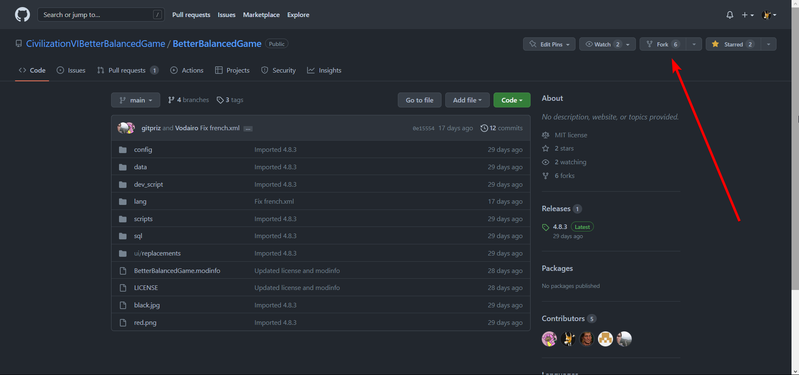
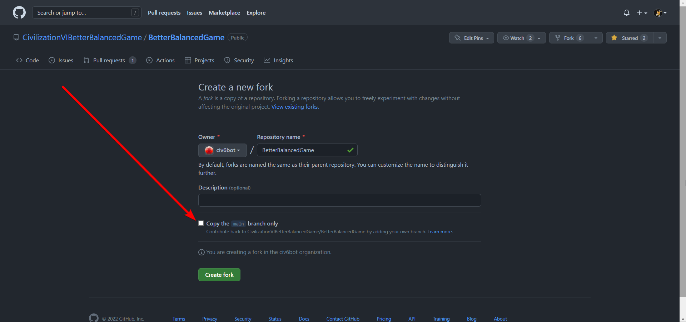
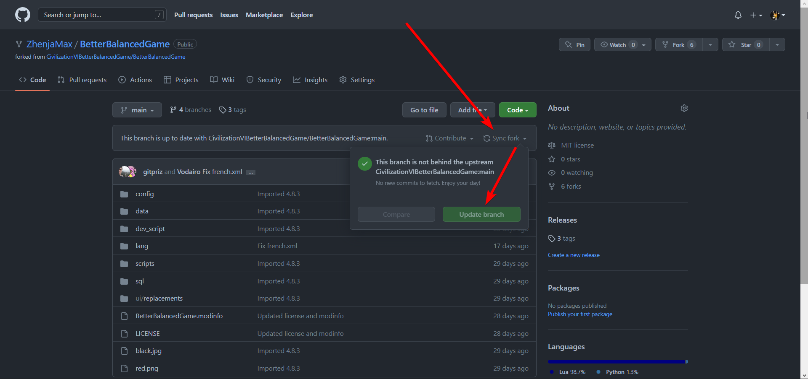
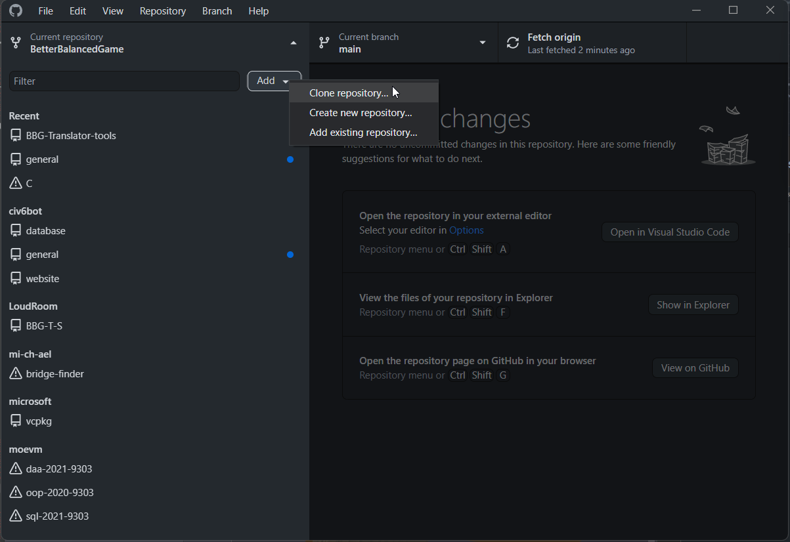
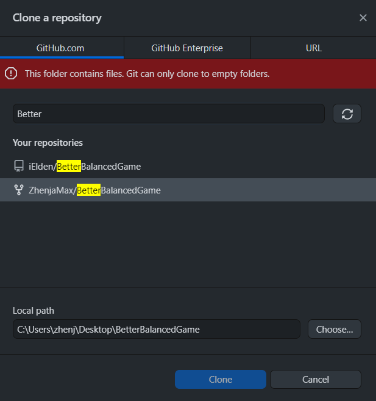
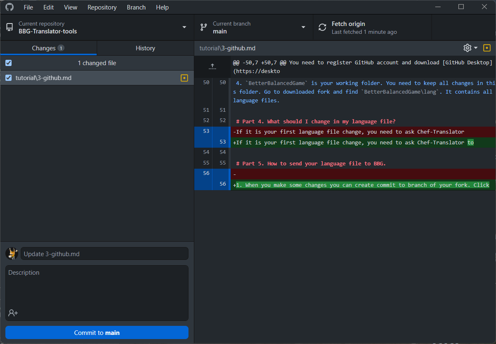
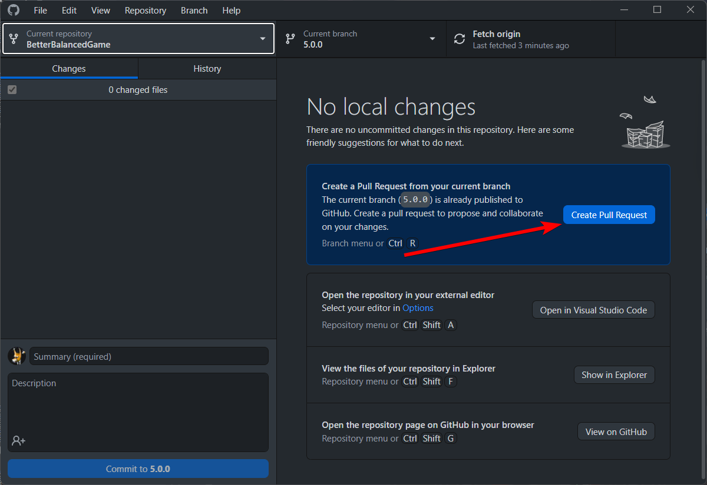
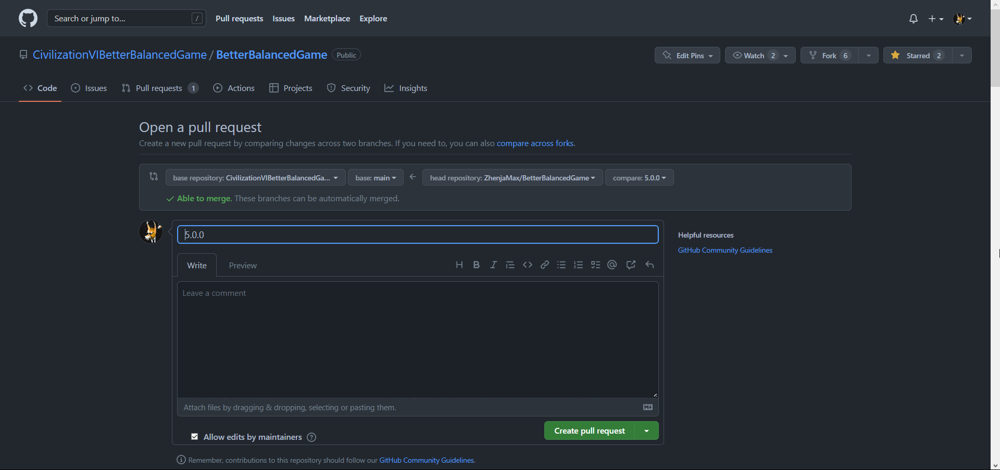

# Chapter III: Minimal GitHub usage and BBG Repository guidelines.

#### Important note: you can skip this chapter and just drop your file and `Database.log` file to #translator-chat, but if you read this and will be able to make these steps then you will save a lot of BBG Devs' and Chef-Translator's time.

Part 1. GitHub account and required software. 
Part 2. Basic concepts. 
Part 3. How to download BBG Mod repository and get language file you need. 
Part 4. What should I change in my language file? 
Part 5. How to send your language file to BBG. 

# Part 1. GitHub account and required software.
You need to register GitHub account and download [GitHub Desktop](https://desktop.github.com). After you downloaded and installed app, authorize to it.

# Part 2. Basic concepts.
- *Repository* - folder of project that contains all files, their change history, all branches and pull-requests.
- *Clone repository* - download repository.
- *Fork* - private copy of repository that contains all files present at the time of creation. Any fork's commit don't change source repository (consider it a "sandbox").
- *Branch* - isolated parallel repository. Every branch should be based on another branch and contain files from based branch. Every repository has `main` branch. Branches can be merged in one branch.
- *Commit* - record about changing one or more files in branch.
- *Pull-request (PR)* - request to move changes from external branch to one of local branches.
- *Merge* - process of integration two branches to one.

# Part 3. How to download BBG Mod repository and get language file you need.
1. Create fork of BBG repository. Go to [BBG Mod repository](https://github.com/CivilizationVIBetterBalancedGame/BetterBalancedGame) and click "Fork" button. Uncheck "Copy the `main` branch only" option and push green "Create fork" button. Now you have forked source repository. Be sure that your **branch** is up-to-date: click to "Sync fork" button and update **your current work branch**, otherwise "Update branch" button will be disabled.

  

  

  

2. Go to GitHub Desktop app and clone your forked repository. `Add` => `Clone Repository...` => `Find with search` => `Clone`.

  

  

3. Change branch of your forked repository. Click "Current branch" button and choose what you need. GitHub Desktop app will download missing files and update them to be up-tp-date with chosen branch.  
❗ **Ask Devs of Chef-Translator what branch is working at the moment.**  
4. `BetterBalancedGame` is your working folder. You need to keep all changes in this folder. Go to downloaded fork and find `BetterBalancedGame\lang`. It contains all language files.

# Part 4. What should I change in my language file?
If it is your first language file change, you need to ask Chef-Translator where you should start. You can get special recommendations for your translation text. For example, a lot of out-dated text require [special compare tool](https://www.textcompare.org/xml/) to get `english.xml` changes through versions.  
If you already have pull-request, you need to check `english.xml` file changes through working branch. These usually have lot of description, so you can decide what you need to import to your language file or what you can skip and ignore:
- almost all gameplay changes need appropriate text changes, so it's likely you will need to add them;
- English text fixes are for English text only (for example, missing space character or typo in game term), but I recommend to check text for your language tag before skip that.

You can collect feedback from users and add new tags or edit text of your language file yourself. You are free to do that anytime. However, you need to check every change of `english.xml` file because it may contain gameplay changes those you should not skip.

# Part 5. How to send your language file to BBG.
1. When you make some local changes you can create commit to branch of your fork. Click blue "Commit to `branch_name`" button at the bottom. You can make **any amount of commits**. Be sure that you have changes **in your language file only**. GitHub Desktop app shows changes you did:
    - red color indicates lines with deleted data;
    - bright red color shows deleted data;
    - green color indicates new inserted lines;
    - bright green color shows new data;
    - if you see red and green line with the same line (number at the left of lines) then it shows difference of this line.

  

2. After you created enough changes and commits, you need to create pull-request to send changes to source repository. Click at "Create Pull Request" button. You will see GitHub BBG Mod repository page in your browser. Check branches of source and destination: **they should be the same**! (Screenshot below has **incorrect** branches: `main` at the left and `5.0.0` at the right) You can check your changes scrolling down. Write title of pull-request, some description (optional) and click "Create pull request" green button.

  

  

❗ We recommend to not send 1 or 2 strings of language file changes (but only if it isn't a fix/correction of previous file changes).